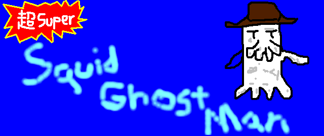

Short, underwater-themed platform game. First developed in summer of 2018 over a month's span, then updated in early 2019.

Originally written for Windows PCs, it aims to be cross platform by way of HTML5 & JavaScript.

---
## Building
Super SquidGhostMan was written in GameMaker Studio 1.4x, with an optimized legacy version in Game Maker 8. Both sources and builds are provided. Edits can be made to the .gmx files and then compiled in GM 1.4 later on. With GM8 the source is archived and requires the IDE for changes.

---

**Download & play it [here!](https://legitvidya.itch.io/super-squidghostman)**
